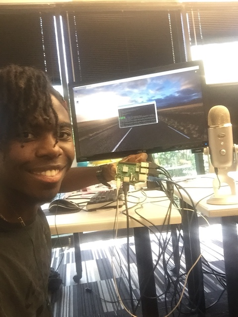

# Raspberry Pitch Perfect / Raspberry Assistant
---


## What Are These?
These two mini-projects are my first attempt at interating hardware , APIs and pre-existing code libraries to try and produce two household items that I can use every day! 
Raspberry Pitch Perfect is a program that detects nearby pitch frequencies and (to the best of it's ability) supplies a steady stream detailing the particular pitch it's hearing!
Raspberry Assistant is a home-made "Google Home" device that utilizes google's public Google Assistant API to function as a FREE Google Home Smart Speaker

## Author
* Jalani Paul
<br>
</img>


## What was Used
* Raspberry Pi3 + MicroSD with Rapsbian installed + Power Supply 
* YETI Professional Multi-Pattern USB Microphone 
* JBL Flip USB / Bluetooth Speaker 
* RGB LED 
* 4 Resistors (1k ohms) 
*  4 Jumper Cables (1 female end)
* 1 Breadboard 

* Audacity
* Python 2.7 and Python 3

* RPiPitch Library (https://github.com/katrinamo/RPiPitch)
* Google Assistant API


## Build Process Walkthrough
My time spent before entering (and also during) my DigitalCrafts experience was spent writing code for use in software development and web development. I saw that members of the previous cohorts explored hardware in addition to using various libraries and original code of their own for making their final projects. Being that I'm all about exploring new facets of technology, I figured that my final project would be a great opportunity to build something cool by combining hardware and the knowledge i'd pick up about using the terminal, API's and manipulating pre-existing code libraries.

### Setting up Hardware
I used the guide linked <a href="https://developers.google.com/assistant/sdk/guides/library/python/embed/setup">here</a> to set up the Raspbian on my Raspberry Pi and configure network access

Google also provided a guide for configuring and testing audio on a Raspberry Pi as well. The instructions I followed can be found <a href="https://developers.google.com/assistant/sdk/guides/library/python/embed/audio">here</a>


### Raspberry Pitch Perfect
#### Step 1: Building the LED Circuit
<ul>
<li>Place female ends of jumper cables into GPIO5 (pin29), GPIO6 (pin31), and GPIO13 (pin33) and any GND pin (I used pi 39 since it was close by)</li>
<li>Connect male end of each jumper cable to indivdual rows on the breadboard</li>
<li>Place one end of a 1k resistor into the peg adjacent to the male end of your jumper cable on the same row. (do this for each jumper cable)</li>
<li>Place other end of the 1k resistors into an adjacent peg.</li>
<li>Insert LED into pegs adjacent to the resistors
    <ul>
    <li> Insert Longest LED wire at the end of GNDpin wire path</li>
    <li> Insert one wire at the end of the GPIO5 wire path</li>
    <li> Insert one wire at the end of the GPIO6 wire path</li>
    <li> Insert one wire at the end of the GPIO13 wire path</li>
    </ul>
</li>
<li>Connect Raspberry Pi to power soruce</li>
</ul>
<p>After setting up the Raspberry Pi, i moved into the getting the hardware set up for displaying red, blue, and light as a response to sharp, flat, and in tune pitches respectively.
The LED that i used had four connectors, each of which would be inserted into a breadboard connected to the raspberry pi</p>
<p> One of the pins on the LED was longer than the other three so I connected it to the GND (ground) GPIO pin on the Raspberry Pi. The other three pins were connected to 5, 6, and 13 because the RPiPitch library set these pins for interaction between the code and the LED.</p>

#### Step 2: Setting up the Code
<p> The Numpy and Scipy environments on the pi need to be set up so that python code and be edited and deployed on the raspberry pi</p>

In Terminal:
```bash
sudo apt-get install python-numpy
sudo apt-get install python-opencv
sudo apt-get install python-scipy
sudo apt-get install python-pyaudio python3-pyaudio

```
<p> Next, I imported the freqDetect.py script from the <a href="ttps://github.com/katrinamo/RPiPitch">RPiPitch Library </A></p>
<p>Out of the box, the script is designed to detect frequencies a person is looking to match when tuning a guitar to standard tuning using cent values. I had notied that the cent values were whole numbers ranging between 0 and 11. <br> I had noticed that the cent values used actually represent the number of half steps away from A on the chromatic scale that a particular note is</p>

Cent Values & Note Variables:
```python
#Max & Min cent value we care about
MAX_CENT = 11
MIN_CENT = 0
RELATIVE_FREQ = 440.0

#notes in cents
Note_E = 5
Note_A = 0
Note_D = 7
Note_G = 2
Note_B = 10
Note_E4= 5

```
Given that there are 12 pitches and A has a cent vaule 0 here, the 12th pitch (A#/Bb) would be have a cent value of 11. This means that all remaining values to incorporate would look like this:
```python
#notes in cents
Note_E = 5
Note_A = 0
Note_GSharp = 1
Note_G = 2
Note_FSharp = 3 
Note_F = 4
Note_E4= 5
Note_DSharp = 6
Note_D = 7
Note_CSharp = 8
Note_C = 9
Note_B = 10
```

<p>As this library is already desinged to pick up the sharps and flats represented in the list of variables, such an extensive list is unneccasary. The only notes that aren't deteectable out of the box are notes C and F on the chromoatic scale so they were the only additions i'd made to the cent variabes.</p>
<br>
-----------------------------

<p> As previously stated, the color of the LED changes in correposndance with the pitches being detected</p>

Sample of the Ineraction Between GPIO and LED: 
```python
#necessary import statement for using GPIO with a project
import RPi.GPIO as GPIO
```
```python  
  #sample case statement
if abs(adjfreq - Note_E4 ) < 1:
			
			#In Tune E
			if abs(adjfreq - Note_E4) < 0.1  :
				print("You played an E!")
				GPIO.output(5, GPIO.LOW)
				GPIO.output(6, GPIO.LOW)
				GPIO.output(13, GPIO.HIGH) #GREEN
			#Sharp E
			elif (adjfreq - Note_E4) <  0  :
				print("You are sharp E!")
				GPIO.output(5, GPIO.HIGH) #RED
				GPIO.output(6, GPIO.LOW) 
				GPIO.output(13, GPIO.LOW) 
			#Flat E
			elif (adjfreq - Note_E4) > 0  :
				print("You are flat E!")
				GPIO.output(5, GPIO.LOW)
				GPIO.output(6, GPIO.HIGH) #BLUE
				GPIO.output(13, GPIO.LOW)
```


## Challenges
<p align='center'>
    </img>
</p>

### Audio Configuration
Initially, getting the audio configuration set up was difficult because I didnt fully understand the syntax involved in configuring the ".asoundrc"
<br>

### Layout & Positioning
The layout for the landing page was inspired by a design that I had found on CodePen.io and reformatted using flexbox and a react library that adds a smooth scrolling react component.
The main app components were styled using flexbox as well.


### Using State as a Database (Category Section)

```javascript
 categories:[
        
        {name: "Sandwiches!", img:sandwiches},
        {name: "MAKE. IT. SPICY.", img:spicy},
        {name: "Would A Small Child Like This?", img:smallchild},
        {name: "Wok This Way (Wok Mandatory)", img:wok},
        {name: "MAKE. IT. SWEET.", img:sweet},
        {name: "Gotta Grill It!", img:grill},
        {name: "Soups", img:soup},
        {name: "Healthy-Eats", img:healthy},
        {name: "Breakfast", img:breakfast}
      ],

      selectedCategories:[
        {name:"", img:""}
      ],
}
```


</p>

### Future Features
<ul>
<li>User Authentication</li>
<li>Switch from state-database to a back-end database</li>
<li>Users update the databse with items from their pantry</li>
<li>Users upload and save pictures of recipes they've created</li>
<li>Sleeker, more modernized app interface</li>
<li></li>
<li></li>
</ul>
